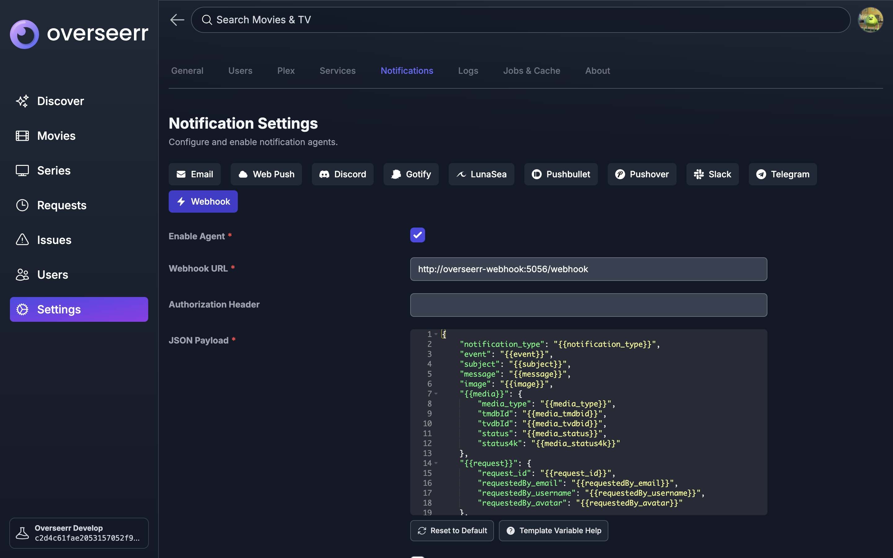

# Overseerr Webhook Listener 🎥🔗✨

## Purpose 🎯📺💡
This webhook listener solves a limitation in Overseerr’s interaction with Sonarr when requesting TV shows. Specifically:

- When requesting a TV show on Overseerr, it can only send full-season requests to Sonarr.
- If the requested season is still airing, Sonarr searches for the entire season pack, which may not exist yet. As a result, episodes are not downloaded individually.
- This webhook addresses the issue by:
  - Detecting when Sonarr fails to find a full season.
  - Automatically triggering individual episode searches for the incomplete seasons.
  - Supporting cases where seasons (e.g., anime arcs) are only available as individual episodes.

## How It Works 🛠️📡🧩

- The webhook listens for requests from Overseerr and checks for TV show requests.
- For each TV show request:
  - It identifies seasons that are incomplete by comparing the monitored seasons against the available episodes.
  - It waits for a predefined period to check if Sonarr finds the season pack in its queue.
  - If the season pack is not found, it triggers individual episode searches for the missing episodes.
- It uses the [Pyarr](https://docs.totaldebug.uk/pyarr/quickstart.html) Python library to interact with Sonarr.

## Setup 🖥️📦🚀

### Prerequisites 📋🔑⚙️

- Ensure you have Docker installed on your system.
- Have access to a Sonarr API key and the host URL of your Sonarr instance.
- Have access to the configuration of Overseerr to set up webhooks.


### Running the Webhook Listener 🏃‍♂️🐳⚡


#### Using Docker Compose (recommended) 📜🔨🚢

After cloning this respository, add the following service to your `docker-compose.yml` file:

```yaml
  overseerr-webhook:
    container_name: overseerr-webhook
    build: path/to/OverseerrWebhook
    environment:
      - SONARR_URL=HOST_URL=<your-sonarr-url>
      - SONARR_API_KEY=<your-sonarr-api-key>
      - FLASK_RUN_PORT=5056 # Port to run the webhook listener internally
    ports:
      - 5056:5056 # Only necessary if overseerr runs elsewhere than in this docker compose file (make sure to expose the port in the Dockerfile)
    restart: unless-stopped
```
Replace `<your-sonarr-url>` with the URL of your Sonarr instance (e.g., `http://localhost:8989`), and `<your-sonarr-api-key>` with your Sonarr API key.

It is highly recommended to run the webhook listener in a same docker-compose file as overseerr and sonarr, as it will make it easier to communicate between the two services. Example of a docker-compose file with overseerr, sonarr and overseerr-webhook:

```yaml
  overseerr-webhook:
    container_name: overseerr-webhook
    build: ./OverseerrWebhook
    depends_on:
      - overseerr # This is the name of the overseerr service in the docker-compose file
    environment:
      - SONARR_URL=sonarr:8989 # This is the name of the sonarr service in the docker-compose file
      - SONARR_API_KEY=<your-sonarr-api-key>
      - FLASK_RUN_PORT=5056
    restart: unless-stopped
```

Then start the container with:

```bash
docker-compose up -d overseerr-webhook
```

### Set up the Webhook 🔍✅📝

In the Overseerr web interface, navigate to `Settings > Notifications` and add a new webhook (tick at least the `Request Approved` event):



- Ensure that Overseerr is configured to send webhook events to `http://<your-server-ip>:5056/webhook`. If overseerr is running in the same docker-compose file as the webhook listener, you can use the service name instead of the IP address (e.g., `http://overseerr-webhook:5056/webhook`).
- Check the logs to confirm that the webhook is processing requests as expected.
- The webhook listener will automatically search for individual episodes if a season pack is not found in Sonarr. Enjoy your TV shows! 🍿🎉📺

## Resources 📚🔗🛠️

This webhook listener leverages the following tools and libraries:

- [Flask](https://flask.palletsprojects.com/) – A lightweight web framework for Python.
- [PyArr](https://github.com/totaldebug/pyarr) – A Python wrapper for interacting with Sonarr and other *Arr APIs.
- [Docker](https://www.docker.com/) – For containerizing and running the application.

For more information on Sonarr’s API and webhooks:
- [Sonarr API Documentation](https://sonarr.tv/#api)
- [Overseerr Webhook Configuration](https://docs.overseerr.dev/)

Feel free to contribute or report issues to improve this webhook listener! 🚀🎉🤝

